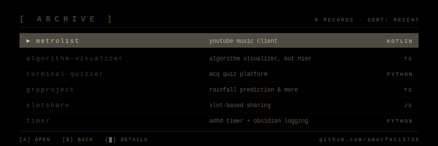

  

  <code>// proxy data retrieved &#183; everything that lives is designed to end &#183; for the glory of mankind</code>

 

  
  

 

  

 

  

 

  <code>python</code> &#183; <code>kotlin</code> &#183; <code>typescript</code> &#183; <code>javascript</code> &#183; <code>c</code> &#183; <code>android</code> &#183; <code>linux</code> &#183; <code>arch</code>

  <a href="https://github.com/amorfati3735">github</a>
  &#160;//&#160;
  <a href="https://amorfati3735.github.io/portfolio_v3/">portfolio</a>

  A2 &#183; 2B &#183; 9S &#8195;|&#8195; <code>glory to mankind</code>

