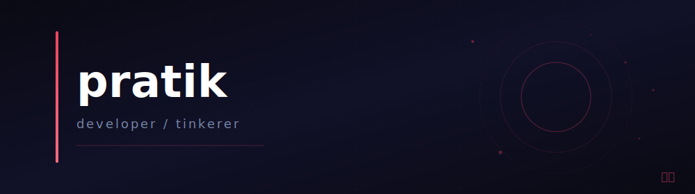

  

 

<pre style="background: transparent; border: none; padding: 0; margin: 0 auto; width: fit-content; font-family: 'Courier New', 'IBM Plex Mono', 'Source Code Pro', monospace; color: #555; font-size: 14px; line-height: 1.9; letter-spacing: 0.5px;">
os             endeavouros x86_64
wm             hyprland
terminal       kitty
shell          fish
</pre>

 

  
  

  

 

| project | description | lang |
| --- | --- | --- |
| [metrolist](https://github.com/amorfati3735/Metrolist) | youtube music client for android | kotlin |
| [algorithm-visualizer](https://github.com/amorfati3735/algorithm-visualizer) | algorithm visualizer, but nier | ts |
| [terminal-quizzer](https://github.com/amorfati3735/terminal-quizzer) | mcq quiz platform | python |
| [grpproject](https://github.com/amorfati3735/grpproject) | rainfall prediction and more | ts |
| [slotshare](https://github.com/amorfati3735/slotshare) | slot-based sharing | js |
| [timer](https://github.com/amorfati3735/timer_withobsidianlogging) | adhd timer with obsidian logging | python |

 

<pre style="background: transparent; border: none; padding: 0; margin: 0 auto; width: fit-content; font-family: 'Courier New', 'IBM Plex Mono', 'Source Code Pro', monospace; color: #777; font-size: 13px; letter-spacing: 1px;">
python  kotlin  typescript  javascript  c  android  linux  arch
</pre>

 

  <a href="https://github.com/amorfati3735" style="color: #555; text-decoration: none;">github</a>
  &nbsp; / &nbsp;
  <a href="https://amorfati3735.github.io/portfolio_v3/" style="color: #555; text-decoration: none;">portfolio</a>

